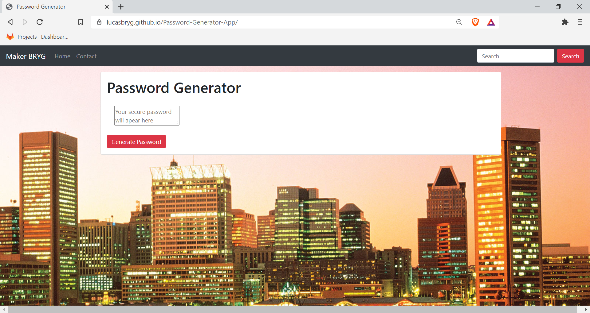
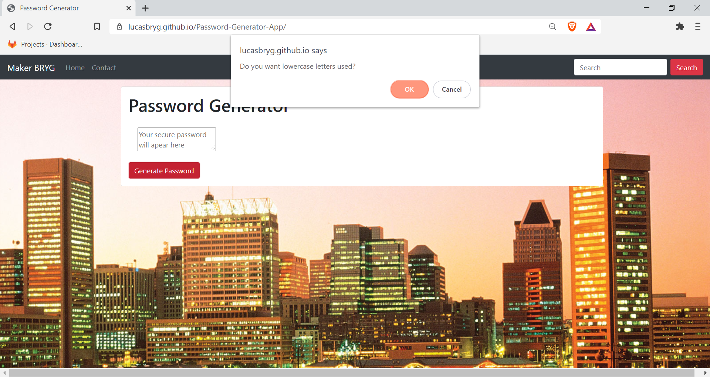
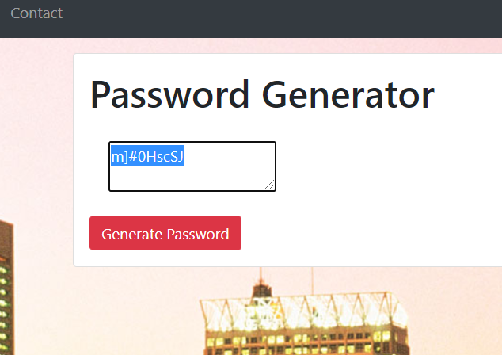

# Password-Generator-App
This is a basic application that will generate a random password, following criteria that the user provides

## Live Site

https://lucasbryg.github.io/Password-Generator-App/





---

### Table of Contents

- [Description](#description)
- [How to Use](#how-to-use)
- [Screenshots](#screenshots)
- [Author Info](#author-info)

---

## Description

### User Story
``````
GIVEN I need a new, secure password
WHEN I click the button to generate a password
THEN I am presented with a series of prompts for password criteria
WHEN prompted for password criteria
THEN I select which criteria to include in the password
WHEN prompted for the length of the password
THEN I choose a length of at least 8 characters and no more than 128 characters
WHEN prompted for character types to include in the password
THEN I choose lowercase, uppercase, numeric, and/or special characters
WHEN I answer each prompt
THEN my input should be validated and at least one character type should be selected
WHEN all prompts are answered
THEN a password is generated that matches the selected criteria
WHEN the password is generated
THEN the password is either displayed in an alert or written to the page
``````

##### Technologies

- JavaScript
- Html
- CSS (Bootstrap)
- deployed on Github


## How To Use

This app is hosted on Github. Visit https://lucasbryg.github.io/Password-Generator-App/ to try it out; just press the "New Password" button and follow the prompts. Your randomized password will appear in the text window

[Back To The Top](#Note_Taker)
 
## Screenshots

###### Home Page


###### Character Prompts



###### New Password




---


## Author

- Linkedin -- https://www.linkedin.com/in/lucas-bryg-codes/
- GitHub -- https://github.com/lucasBRYG/

[Back To The Top](#Note_Taker)